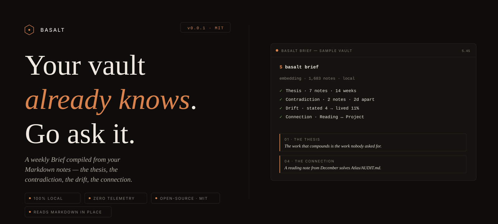

<p align="center">
  
</p>

# Basalt

> **Reads your Markdown vault and surfaces what you believe but never wrote down.**


## Who this is for

You've written 400+ daily notes. They link to each other. They were useful
in the moment. None of them feed into what you're working on now. The claim
from six months ago that the last four weeks of work depend on is still in
there — you just can't find it. **Basalt finds it.**

You're a developer using Obsidian (or Logseq, or a folder of `.md` files)
as project context for Claude / Cursor / your editor of choice. You don't
want another note-taking methodology. You want your existing vault to do
more for you, without moving anything, and without sending it anywhere.

You've tried PARA, Zettelkasten, BASB, Smart Connections. They worked
exactly as long as you were reading the book about them. **Basalt has no
methodology to impose** — it sits on top of whatever you already have.

## The wedge

Basalt is the only second-brain compiler in this category that
**doesn't require Claude Code**, **doesn't write to your vault**, and
**doesn't make a single network call** in the Open tier. Standalone Python.
Read-only. Local-first. Three load-bearing properties — every other shipped
project in this space gives up at least one of them.

Basalt compiles a longitudinal model of *you* — claims, priorities, drift,
theses — and exposes it as cognitive verbs. It sits atop your existing
vault. It does not replace your editor. It runs locally.

The signature output is **The First Brief** — a single page with citation-
grounded sections, each ending in a one-click commit. Four unlocks, all shipping:
**Implicit Thesis · Contradiction · Drift · Connection.**

Status: **Phase 0 complete.** All four site-advertised unlocks ship in v0.0.8,
plus the bonus 5th unlock (Buried Insight) and a Calibration Layer that grades
past findings. Verified on a 1,683-note production vault. Phase 1 adds LLM
synthesis (named theses, classifier-validated contradictions). See
[virtuosoai.dev/basalt](https://virtuosoai.dev/basalt/).

---

## Prereqs

- **Python 3.12+**
- **[Ollama](https://ollama.com)** running locally
- The embedding model: `ollama pull nomic-embed-text`
- A Markdown vault (Obsidian, Logseq, plain folder of `.md` — anything works)

## Quickstart

```bash
python3.12 -m venv .venv && source .venv/bin/activate
pip install basalt-vault
```

Or with MCP server:

```bash
pip install 'basalt-vault[mcp]'
```

Try the demo (no vault required — uses a sample vault bundled with the repo):

```bash
basalt demo
```

Or point at your own vault:

```bash
basalt index --vault ~/path/to/your-vault
basalt brief --section all
```

> **Building from source:** `git clone https://github.com/virtexvirtuoso/basalt.git && cd basalt && pip install -e .`

## Verbs shipped (4/4 site-advertised + 1 bonus)

| Verb | Site language | What it actually does |
|------|---------------|-----------------------|
| **Implicit Thesis** *(v0)* | *"The thing you keep saying without realizing you're saying the same thing."* | Tight-neighborhood (near-clique) clusters of 3-15 notes converging on an unnamed through-line. Centroid's load-bearing sentence is the proxy thesis statement |
| **Contradiction** *(v0)* | *"The two notes you wrote that can't both be true."* | Pairs of same-topic notes whose load-bearing sentences carry asymmetric negation, reversal markers, or polarity pairs (`ship` ↔ `kill`, `works` ↔ `broken`). v0 is heuristic — output is candidates, not verdicts |
| **Drift** | *"What you say is the priority versus what you actually spent the week on."* | Stated priority (project-folder note count) vs lived priority (daily-note mentions over a 30-day window). Surfaces the largest divergence — *"Moonshot is your stated #9 but lived #1"* |
| **Connection** | *"The two ideas in different folders that turn out to be the same idea."* | Pairs of notes across different top-level folders, no wikilink between them, embedding similarity ≥ 0.78 |
| **Buried Insight** | (bonus 5th unlock) | A note you wrote once and never returned to, that recent notes still cite — explicit links plus semantic validators |

### Planned (Phase 1 — LLM-augmented Pro tier)

| Verb | Promotion | What it needs |
|------|-----------|---------------|
| **Implicit Thesis v1** | *named* — not just a cluster | LLM synthesis pass over the v0 cluster — produces the through-line sentence the user hasn't written |
| **Contradiction v1** | *proven* — not just a candidate | LLM pairwise compatibility classifier filtering v0 heuristic candidates |
| **Drift v1** | *auto-audited* | Re-run drift on the current window during `basalt audit` — auto-falsify drift findings whose shares re-converged |

## Commands

| Command | What it does |
|---------|--------------|
| `basalt demo` | Index the bundled sample vault and run a brief — no setup, no vault needed |
| `basalt index --vault PATH` | Walk vault, parse frontmatter, build link graph, embed every note |
| `basalt brief` | Surface the strongest buried insight (default top 1) |
| `basalt brief --section connection --top 3` | Surface 3 connections — same idea across folders, no wikilink |
| `basalt brief --section contradiction --top 3` | Surface 3 contradiction candidates (v0) |
| `basalt brief --section implicit-thesis --top 2` | Surface 2 implicit theses (v0 cluster heuristic) |
| `basalt brief --section drift` | Surface stated-vs-lived priority drift over the last 30 days |
| `basalt brief --section all` | Run every shipped verb in one pass — 4 unlocks + Buried Insight |
| `basalt thesis` / `basalt drift` / `basalt connection` / `basalt contradiction` | Convenience subcommands per verb |
| `basalt audit` | Re-evaluate pending findings against the current vault — see your track record |
| `basalt about` | Wordmark + the geological metaphor + schema version |
| `basalt brief --strict-defaults` | Buried Insight only — fixed 180/90/180 thresholds vs vault-age-aware |

Run `basalt --help` for everything.

## Sample output

```
THE BURIED INSIGHT
─────────────────────
vault age: 244d  ·  thresholds: age≥122d  dormant≥40d  recent≤122d

On 2025-09-12 you wrote, in 02-Projects/SignalBot/HYPOTHESIS.md:

  The sustainable edge isn't speed alone — it's speed + intelligence.
  (callout body)

Since then, 4 notes link back.
You haven't returned to this claim since you wrote it.

   → 02-Projects/SignalBot/PHASE2.md            (2026-03-14)
   → 02-Projects/SignalBot/BACKTEST.md          (2026-03-21)
   → 02-Projects/SignalBot/CALIBRATION.md       (2026-04-02)
   → 02-Projects/SignalBot/PRODUCTION-NOTES.md  (2026-04-18)

   ▸ Promote to thesis     ▸ Open all     ▸ Snooze
```

```
CONNECTIONS  (2)
─────────────────────
two ideas in different folders that turn out to be the same idea

01.
similarity 0.90  ·  no wikilink between them

  A  09-AI-Context/whale-monitoring-infrastructure.md
     1,330 orderflow tests, 2,808 derivatives tests — zero Bonferroni
     survivors.
     (blockquote summary)

  B  02-Projects/Gem Hunter/_archived/WHALE_MOVEMENT_TRACKING.md
     Whale activity analysis is automatically included in token scoring.
     (first prose sentence)

   ▸ Link A ↔ B     ▸ Open both     ▸ Dismiss
```

## How it works

| Layer | Tech |
|-------|------|
| **Substrate** | Your existing Markdown vault — never moved, never modified without consent |
| **Compiler** | SQLite (notes, links, embeddings) + numpy similarity + content-hash incremental |
| **Embeddings** | Ollama `nomic-embed-text` by default; `bge-m3` and Qwen3-Embedding-8B coming for the Pro tier |
| **Verbs** | Cognitive operations exposed as CLI commands (MCP server wrapper next) |

Every verb reuses the same primitives:
- **Sentence-aware quote extraction** — picks the punchline (em-dash, negation, conclusion-opener) over the setup line; strips Markdown noise; refuses cliffhangers (no quote ending in `:` or `,`).
- **Hub-note penalty** — outgoing-link-density per 100 words. Hard-excludes MOCs above 1.5; soft-penalizes 0.5–1.5 gray zone.
- **Vault-age-aware thresholds** — Buried Insight derives age/dormancy windows from the oldest note's date; clamped to sensible floors and ceilings.

## MCP integration

Basalt exposes its verb library as an MCP server, so any MCP-compatible
client (Claude Desktop, Cursor, Cline, Zed, VS Code Copilot) can call
Basalt's verbs as tools.

```bash
pip install 'basalt-vault[mcp]'
basalt-mcp --help
```

Wire into Claude Desktop (`~/Library/Application Support/Claude/claude_desktop_config.json`):

```json
{
  "mcpServers": {
    "basalt": {
      "command": "basalt-mcp"
    }
  }
}
```

Or with explicit paths:

```json
{
  "mcpServers": {
    "basalt": {
      "command": "basalt-mcp",
      "args": ["--vault", "/path/to/vault", "--db", "/path/to/basalt.db"]
    }
  }
}
```

Then ask Claude: *"run a Basalt brief on my vault, all sections, top 2."*

The MCP server exposes 4 tools:

| Tool | Maps to | Notes |
|------|---------|-------|
| `basalt_brief` | `basalt brief` | Buried Insight / Connection / Contradiction; returns finding objects with falsification rules |
| `basalt_connection` | `basalt connection` | Just connections, with `min_sim` knob |
| `basalt_contradiction` | `basalt contradiction` | v0 heuristic candidates |
| `basalt_audit` | `basalt audit` | Re-evaluates pending findings, returns track record |

The server is **read-only on the vault** — it never writes to your `.md` files.
Run `basalt index` from the CLI before pointing the MCP server at a fresh vault.

## Privacy

Local-first by default. Your vault is read from disk; embeddings are computed
by your local Ollama; the SQLite index lives at `~/.basalt/basalt.db`. **No
network calls leave your machine in the Open tier.** See [PRIVACY.md](PRIVACY.md)
for the full posture, and [SECURITY.md](SECURITY.md) for the threat model.

## Contributing

Open an issue first for anything non-trivial. Follow the existing module shape
— small, named, single-purpose.

## License

[MIT](LICENSE) — Fernando Villar / Virtuoso Crypto, 2026.
