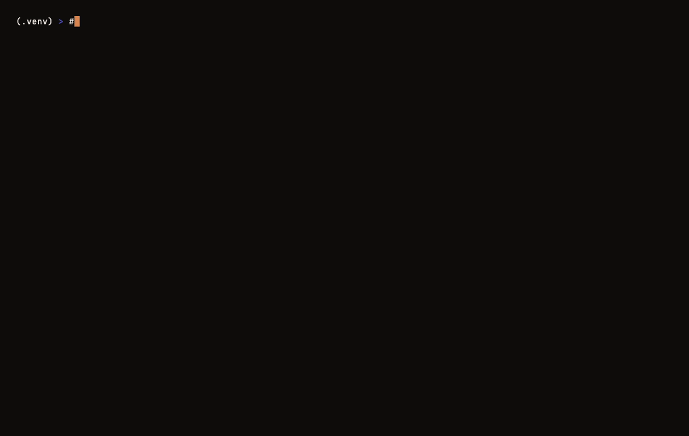

# Basalt

> Reads your Markdown vault and surfaces what you believe but never wrote down.



**The wedge:** Basalt is the only second-brain compiler in this category
that **doesn't require Claude Code**, **doesn't write to your vault**, and
**doesn't make a single network call** in the Open tier. Standalone Python.
Read-only. Local-first. Three load-bearing properties — every other shipped
project in this space gives up at least one of them.

Basalt compiles a longitudinal model of *you* — claims, priorities, drift,
theses — and exposes it as cognitive verbs. It sits atop your existing
vault. It does not replace your editor. It runs locally.

The signature output is **The First Brief** — a single page with citation-
grounded sections, each ending in a one-click commit. The site advertises
four unlocks: **Implicit Thesis · Contradiction · Drift · Connection.**

Status: **Phase 0 — Compiler skeleton in build.** Connection, Contradiction
(v0 heuristic), and Buried Insight are shipped and pass on a 1,683-note
vault. Implicit Thesis and Drift are scheduled for Phase 1. See
[virtuosoai.dev/basalt](https://virtuosoai.dev/basalt/).

---

## Prereqs

- **Python 3.12+**
- **[Ollama](https://ollama.com)** running locally
- The embedding model: `ollama pull nomic-embed-text`
- A Markdown vault (Obsidian, Logseq, plain folder of `.md` — anything works)

## Quickstart

> **Heads up:** the PyPI name `basalt` is already taken by an unrelated
> package. Install from source for now. PyPI distribution as `basalt-vault`
> coming once Phase 0 lands.

```bash
git clone https://github.com/virtexvirtuoso/basalt.git
cd basalt
python3.12 -m venv .venv && source .venv/bin/activate
pip install -e .
```

Try the demo (no vault required — uses a sample vault bundled with the repo):

```bash
basalt demo
```

Or point at your own vault:

```bash
basalt index --vault ~/path/to/your-vault
basalt brief --section all
```

## Verbs shipped

| Verb | Site language | What it actually does |
|------|---------------|-----------------------|
| **Buried Insight** | (a 5th, deeper unlock) | Surfaces a note you wrote once and never returned to, that recent notes still cite — explicit links plus semantic validators |
| **Connection** | *"The two ideas in different folders that turn out to be the same idea."* | Pairs of notes across different top-level folders, no wikilink between them, embedding similarity ≥ 0.78 |
| **Contradiction** *(v0)* | *"The two notes you wrote that can't both be true."* | Pairs of same-topic notes whose load-bearing sentences carry asymmetric negation, reversal markers, or polarity pairs (`ship` ↔ `kill`, `works` ↔ `broken`). v0 is heuristic — output is candidates, not verdicts |

### Planned (Phase 1)

| Verb | Site language | What it needs |
|------|---------------|---------------|
| **Implicit Thesis** | *"The thing you keep saying without realizing you're saying the same thing."* | Claim ledger + cross-domain LLM clustering |
| **Drift** | *"What you say is the priority versus what you actually spent the week on."* | Daily-note time-marker parser + stated-vs-lived priority diff |
| **Contradiction v1** | (proven, not just candidate) | LLM pairwise compatibility classifier filtering v0 candidates |

## Commands

| Command | What it does |
|---------|--------------|
| `basalt demo` | Index the bundled sample vault and run a brief — no setup, no vault needed |
| `basalt index --vault PATH` | Walk vault, parse frontmatter, build link graph, embed every note |
| `basalt brief` | Surface the strongest buried insight (default top 1) |
| `basalt brief --section connection --top 3` | Surface 3 connections — same idea across folders, no wikilink |
| `basalt brief --section contradiction --top 3` | Surface 3 contradiction candidates (v0) |
| `basalt brief --section all` | Run every shipped verb in one pass |
| `basalt connection --top 5` | Convenience: connections only |
| `basalt contradiction --top 5` | Convenience: contradictions only |
| `basalt brief --strict-defaults` | Buried Insight only — fixed 180/90/180 thresholds vs vault-age-aware |

Run `basalt --help` for everything.

## Sample output

```
THE BURIED INSIGHT
─────────────────────
vault age: 244d  ·  thresholds: age≥122d  dormant≥40d  recent≤122d

On 2025-09-12 you wrote, in 02-Projects/SignalBot/HYPOTHESIS.md:

  The sustainable edge isn't speed alone — it's speed + intelligence.
  (callout body)

Since then, 4 notes link back.
You haven't returned to this claim since you wrote it.

   → 02-Projects/SignalBot/PHASE2.md            (2026-03-14)
   → 02-Projects/SignalBot/BACKTEST.md          (2026-03-21)
   → 02-Projects/SignalBot/CALIBRATION.md       (2026-04-02)
   → 02-Projects/SignalBot/PRODUCTION-NOTES.md  (2026-04-18)

   ▸ Promote to thesis     ▸ Open all     ▸ Snooze
```

```
CONNECTIONS  (2)
─────────────────────
two ideas in different folders that turn out to be the same idea

01.
similarity 0.90  ·  no wikilink between them

  A  09-AI-Context/whale-monitoring-infrastructure.md
     1,330 orderflow tests, 2,808 derivatives tests — zero Bonferroni
     survivors.
     (blockquote summary)

  B  02-Projects/Gem Hunter/_archived/WHALE_MOVEMENT_TRACKING.md
     Whale activity analysis is automatically included in token scoring.
     (first prose sentence)

   ▸ Link A ↔ B     ▸ Open both     ▸ Dismiss
```

## How it works

| Layer | Tech |
|-------|------|
| **Substrate** | Your existing Markdown vault — never moved, never modified without consent |
| **Compiler** | SQLite (notes, links, embeddings) + numpy similarity + content-hash incremental |
| **Embeddings** | Ollama `nomic-embed-text` by default; `bge-m3` and Qwen3-Embedding-8B coming for the Pro tier |
| **Verbs** | Cognitive operations exposed as CLI commands (MCP server wrapper next) |

Every verb reuses the same primitives:
- **Sentence-aware quote extraction** — picks the punchline (em-dash, negation, conclusion-opener) over the setup line; strips Markdown noise; refuses cliffhangers (no quote ending in `:` or `,`).
- **Hub-note penalty** — outgoing-link-density per 100 words. Hard-excludes MOCs above 1.5; soft-penalizes 0.5–1.5 gray zone.
- **Vault-age-aware thresholds** — Buried Insight derives age/dormancy windows from the oldest note's date; clamped to sensible floors and ceilings.

## MCP integration

Basalt exposes its verb library as an MCP server, so any MCP-compatible
client (Claude Desktop, Cursor, Cline, Zed, VS Code Copilot) can call
Basalt's verbs as tools.

```bash
pip install -e ".[mcp]"
basalt-mcp --help
```

Wire into Claude Desktop (`~/Library/Application Support/Claude/claude_desktop_config.json`):

```json
{
  "mcpServers": {
    "basalt": {
      "command": "basalt-mcp"
    }
  }
}
```

Or with explicit paths:

```json
{
  "mcpServers": {
    "basalt": {
      "command": "basalt-mcp",
      "args": ["--vault", "/path/to/vault", "--db", "/path/to/basalt.db"]
    }
  }
}
```

Then ask Claude: *"run a Basalt brief on my vault, all sections, top 2."*

The MCP server exposes 4 tools:

| Tool | Maps to | Notes |
|------|---------|-------|
| `basalt_brief` | `basalt brief` | Buried Insight / Connection / Contradiction; returns finding objects with falsification rules |
| `basalt_connection` | `basalt connection` | Just connections, with `min_sim` knob |
| `basalt_contradiction` | `basalt contradiction` | v0 heuristic candidates |
| `basalt_audit` | `basalt audit` | Re-evaluates pending findings, returns track record |

The server is **read-only on the vault** — it never writes to your `.md` files.
Run `basalt index` from the CLI before pointing the MCP server at a fresh vault.

## Privacy

Local-first by default. Your vault is read from disk; embeddings are computed
by your local Ollama; the SQLite index lives at `~/.basalt/basalt.db`. **No
network calls leave your machine in the Open tier.** See [PRIVACY.md](PRIVACY.md)
for the full posture, and [SECURITY.md](SECURITY.md) for the threat model.

## Contributing

Open an issue first for anything non-trivial. Follow the existing module shape
— small, named, single-purpose.

## License

[MIT](LICENSE) — Fernando Villar / Virtuoso Crypto, 2026.
